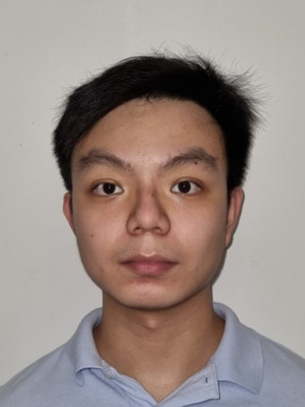
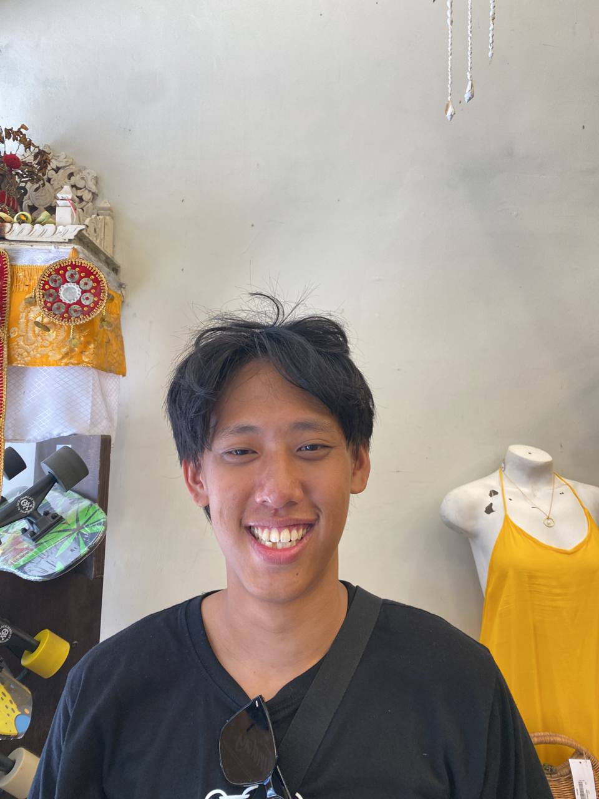
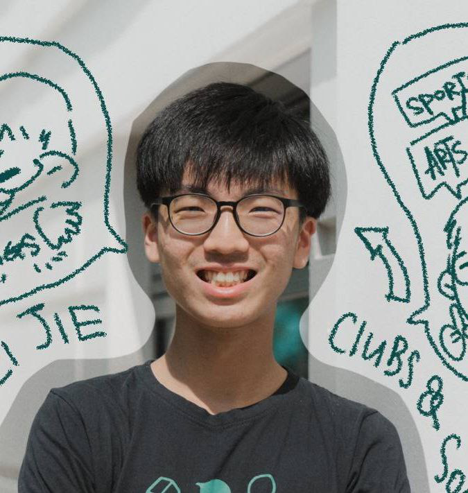

# About Us

We are a team based in the [School of Computing, National University of Singapore](http://www.comp.nus.edu.sg).

You can reach us at the email `seer[at]comp.nus.edu.sg`

## Project team

### Wei Xiang

[[github](https://github.com/roerere)]
[[portfolio](team/roerere.md)]

* Role: Developer
* Responsibilities: Code Quality

### Ren Jing

[[github](https://github.com/TeeRenJing)]
[[portfolio](team/teerenjing.md)]

* Role: Developer
* Responsibilities: Testing

### Shyan-Yong

[[github](http://github.com/shyanyong)]
[[portfolio](team/shyanyong.md)]

* Role: Team Lead
* Responsibilities: UI

### Jing Yu

[[github](http://github.com/jingyu987)] 
[[portfolio](team/jingyu987.md)]

* Role: Developer
* Responsibilities: Data

### Wei Jie

[[github](http://github.com/chongweijie29)]
[[portfolio](team/chongweijie29.md)]

* Role: Integration, Developer
* Responsibilities: Logic
