# BayMeds v.2103 User Guide

## Welcome to the BayMeds User Guide!

This guide provides step-by-step documentation on BayMeds' features and commonly encountered errors. In addition, the [quick start guide](#quick-start) shows you how to get started in a matter of minutes!

### What is BayMeds?

BayMeds v.2103 (a.k.a BayMeds) is your go-to prescription management solution, catering to chronically ill patients or caregivers seeking a streamlined and effective way to track prescriptions. Ideal for those with busy lives and complex medication regimens, BayMeds offer reminders for staying on top of prescription schedules and provides a platform to track prescription consumptions. With a focus on user-friendliness, BayMeds aims to promote medication adherence and reduce misusage.

### What can I do with BayMeds?

#### Track consumption of existing prescriptions

BayMeds filters and shows you your prescriptions to be consumed each day. By marking prescriptions you have consumed, BayMeds will differentiate and show you the prescriptions that are completed and those that have yet to be completed for the day.

#### Store important details of existing prescriptions

BayMeds allows you to store details crucial to the consumption of the prescription, such as the end and expiry date of the prescription, as well as the current stock of pills available. You may also store specific requirements that a prescription may have, such as restricted consumption to only after heavy meals.

#### Get warnings for conflicting drugs

BayMeds informs you when you have drugs that conflicts with each other, e.g. drugs that react with other drugs or affect the efficacy of other drugs. This is especially useful for patients with multiple prescriptions, as it helps to prevent the consumption of conflicting drugs.

#### Track past prescriptions

BayMeds enables storage of past prescriptions, i.e. prescriptions that you have completed in the past. This provides ease of access to such information when required, such as during a Doctor's visit, or when checking how many pills of a particular prescription I took in the past I have left.

### Table of Contents
* <span style="color:red">**To be added.**</span>

### How to use this guide

Navigate to the Table of Contents anytime by clicking the button in the bottom right corner of your screen.

Also, here are some common icons you may encounter in this guide.

| Icon                      | Description            |
|---------------------------|------------------------|
| <box type="definition" /> | Examples               |
| <box type ="tip" />       | Useful tips            |
| <box type="info" />       | Additional information |
| <box type="warning" />    | Warning                |
| <box type="wrong" />      | Errors                 |

--------------------------------------------------------------------------------------------------------------------

## Quick start

<box type="tip">

If you are experienced in using JAR applications, simply download the latest version [here](https://github.com/AY2324S1-CS2103T-T15-2/tp/releases) and start the application.

</box>

1. Ensure you have Java `11` or above installed in your Computer.

1. Download the latest `BayMeds.jar` from [here](https://github.com/AY2324S1-CS2103T-T15-2/tp/releases).

1. Copy the file to the folder you want to use as the _home folder_ for BayMeds.

1. Open a command terminal, `cd` into the folder you put the jar file in, and use the `java -jar BayMeds.jar` command to start the application.<br>


   A GUI similar to the one below should appear in a few seconds. Note how the app contains some sample data.<br><br>
   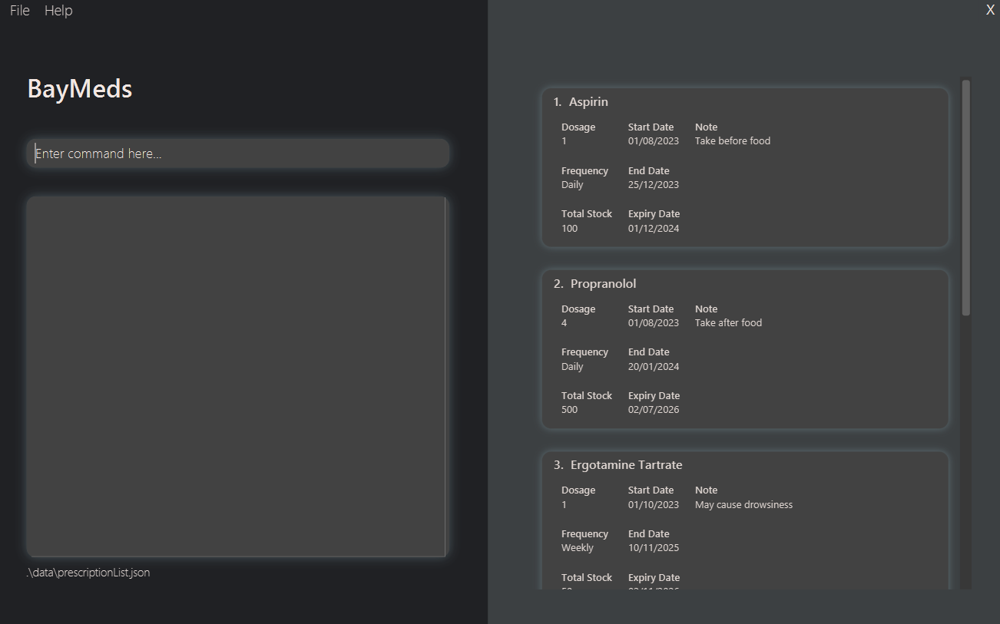

1. Type commands in the command box and press Enter to execute it. <br> e.g. typing the command **`help`** and pressing Enter will open the help window.<br>

   Some example commands you can try:

   * `list` : Shows all your prescriptions.

   * `add mn/Doxazosin f/Daily` : Adds a prescription `Doxazosin` to the list.

   * `delete 2` : Deletes the second prescription in the list.


1. Refer to the [features](#features) below for details of each command.

--------------------------------------------------------------------------------------------------------------------

## Features

<box type="info" header="**Notes about the command format**">

* Words in `<>` are parameters you can enter.
  <box type="definition" header="Example" seamless>

  For `add mn/<medication_name>`, `<medication_name>` is a parameter which can be used as `add mn/Aspirin`.
  </box>

* Items in square brackets are optional.
  <box type="definition" header="Example" seamless>

  `<medication_name> [sd/<start_date>]` can be used as `mn/Aspirin sd/25/10/2023` or as `mn/Aspirin`.
  </box>

* Parameters can be in any order.
  <box type="definition" header="Example" seamless>

  For `mn/<medication_name> f/<frequency>`, `f/<frequency> mn/<medication_name>` is also acceptable.
  </box>

* If you are using a PDF version of this document, be careful when copying and pasting commands that span multiple lines as space characters surrounding line-breaks may be omitted when copied over to the application.

</box>

### Adding a prescription : `add`

Upon getting a new prescription from the doctor, BayMeds allows you to add the prescription to the list.

To add the prescription, type the following command.

Format:
```
add
  mn/<medication_name>
  [d/<dosage>]
  [f/<frequency>]
  [sd/<start_date>]
  [ed/<end_date>]
  [exp/<expiry_date>]
  [ts/<total_stock>]
  [cfdg/<conflicting_drugs>]
  [n/<note>]
```

The prescription will then be added and shown in the list.

<box type="info" header="Notes">

* `<medication_name>`, as the name suggests, refers to the name of the medication.
  <box type="definition" header="Example" seamless>

  Aspirin, Doxazosin, Propranolol
  </box>

* `<dosage>` refers to the number of pills to be taken. It only accepts a numeric value.
  <box type="definition" header="Example" seamless>

  For 1 pill, type 1.
  </box>

* `<frequency>` refers to the interval to consume the prescription. It only accepts the inputs `Daily`, `Weekly` or `Monthly`.

* `<start_date>`, `<end_date>` and `<expiry_date>` should be in <span style="color:red">**dd/mm/yyyy format**</span>.
  <box type="definition" header="Example" seamless>

  For 20th Septemeber 2023, type `20/09/2023`.
  </box>
* `<total_stock>` refers to the total number of pills you have. It only accepts a numeric value.
  <box type="definition" header="Example" seamless>

  For 100 pills, type 100.
  </box>
* `<conflicting_drugs>` refers to the drugs that conflict with your prescription. It accepts space separated drug names.
  <box type="definition" header="Example" seamless>

  If your prescription has 2 conflicting drugs (Paracetamol and Aspirin), type Paracetamol Aspirin.
  </box>
* `<note>` refers to any important or special information you would like to include.
  <box type="definition" header="Example" seamless>

  "To be taken after meals".
  "Take after food".
  </box>

</box>

<box type="definition" header="#### Example 1">

```
add mn/Isotretinoin d/1 f/Weekly sd/01/08/2023 ed/25/12/2023 exd/01/01/2024 ts/100 n/Take only after dinner
```
Typing this command will add a new prescription with the following information.
* Medication name: Isotretinoin
* Dosage: 1
* Frequency: Weekly
* Start date: 01/08/2023
* End date: 25/12/2023
* Expiry date: 01/01/2024
* Total stock: 100
* Note: Take only after dinner

After successfully adding the prescription, you will get the following result: <br>

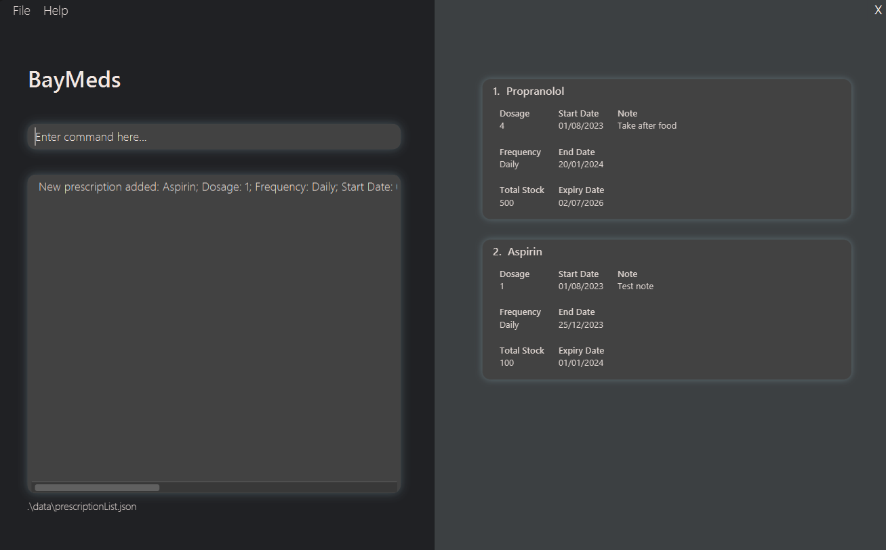

</box>

<box type="definition" header="#### Example 2">

```
add mn/Doxazosin
```
Typing this command will add a new prescription with the following information.
* Medication name: Doxazosin

After successfully adding the prescription, you will get the following result: <br>

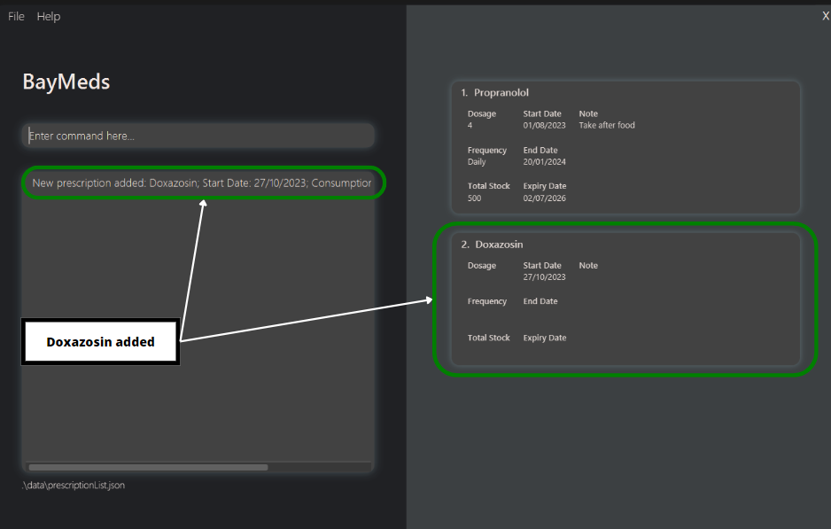

<box type="info">

As shown in this example, the date of which this entry was entered will be used as the default start date if no start date was given.
</box>

</box>

### Listing all prescriptions : `list`

If you want to view your all of your current prescriptions, type the following command.

Format:
```
list
```

You will then be able to see all your current prescriptions on the right side.

<box type="definition" header="#### Example">

If you have prescriptions in the list, you will get something similar to this.

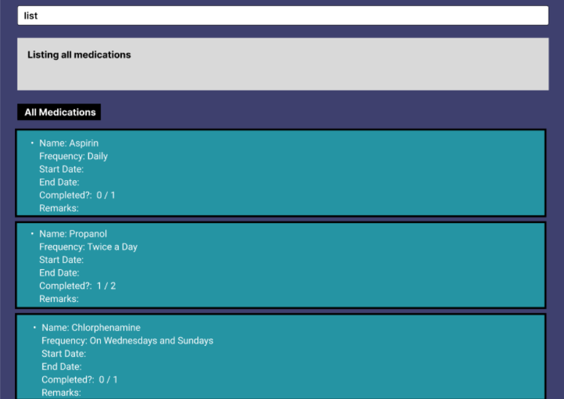

</box>

### How to list today's medications : `listToday`

If you would like to see which prescriptions you need to take **today**, type the following command.

Format:
```
listToday
```

You will then be able to see today's prescriptions on the right side.

<box type="definition" header="#### Example">

If you have prescriptions to take today, you will see something similar to this.


</box>

### Listing completed prescriptions : `listCompleted`

If you need a simple way to summarise your consumption history, type the following command.

Format:
```
listCompleted
```

You will then be able to see your completed prescriptions on the right side.

<box type="definition" header="#### Example">

If you have completed prescriptions, you will see something similar to this.

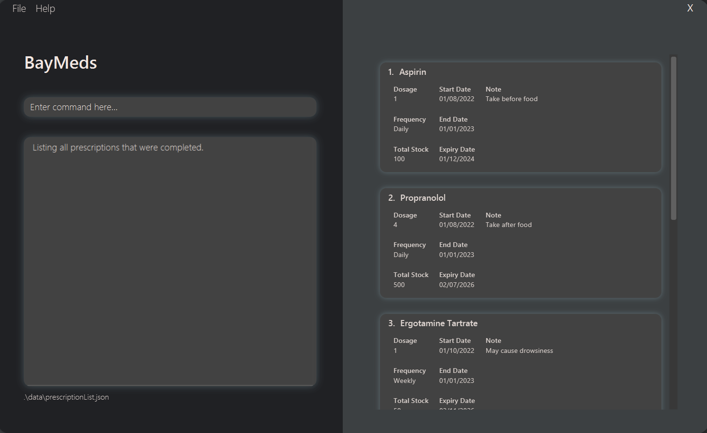

</box>

### How to edit a prescription : `edit`

If you made a mistake and would like to make some changes to your entry, type the following command.

Format:
```
edit
  INDEX
  [mn/NAME]
  [d/DOSAGE]
  [f/FREQUENCY]
  [sd/START DATE]
  [ed/END DATE]
  [exd/EXPIRY DATE]
  [ts/TOTAL STOCK]
  [n/NOTE]
```

This edits the prescription at the specified `INDEX`. The index refers to the index number shown according to [list](#listing-all-prescriptions--list).

<box type="info" header="Notes">

* The index **must be a positive integer** 1, 2, 3, …​
* At least one of the optional fields must be provided.
* Existing values will be updated to the input values.
* Input values cannot be empty.

</box>

<box type="definition" header="#### Example 1">

```
edit 1 d/2 f/Daily
```

Typing this command edits the dosage and frequency of the 1st prescription to be `2` and `Daily` respectively.

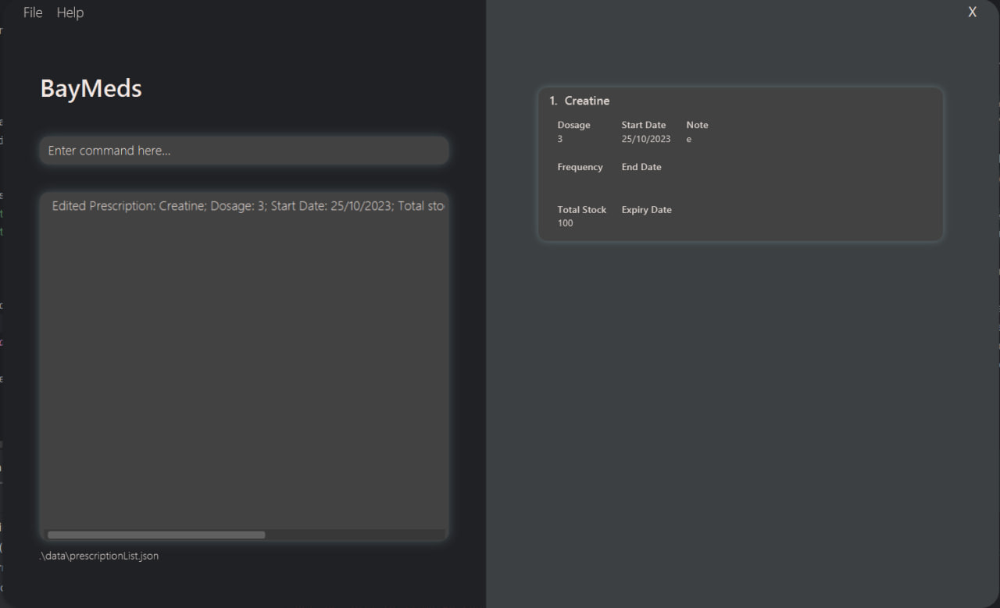

</box>

<box type="definition" header="#### Example 2">

```
edit 2 mn/Creatine n/Red Pill
```

Typing this command edits the name of the 2nd prescription to be `Creatine` and note to be `Red Pill`.

</box>

### Locating prescriptions by name : `find`

Finds prescriptions which names contain any of the given keywords.

Format: `find KEYWORD [MORE_KEYWORDS]`

* The search is case-insensitive. e.g `paracetamol` will match `Paracetamol`.
* The order of the keywords does not matter. e.g. `Ketoconazole Shampoo` will match `Shampoo Ketoconazole`.
* Only the name is searched.
* Substrings will be matched e.g. `Para` will match `Paracetamol`.
* Prescriptions matching at least one keyword will be returned (i.e. `OR` search).
  e.g. `Ketorolac ophthalmic` will return `Ketotifen ophthalmic`, `Ketorolac Tromethamine`.

Examples:
* `find Ketoconazole` returns `Ketoconazole` and `Ketoconazole Shampoo`.
* `find Ketorolac ophthalmic` returns `Ketotifen ophthalmic`, `Ketorolac Tromethamine`.<br>
  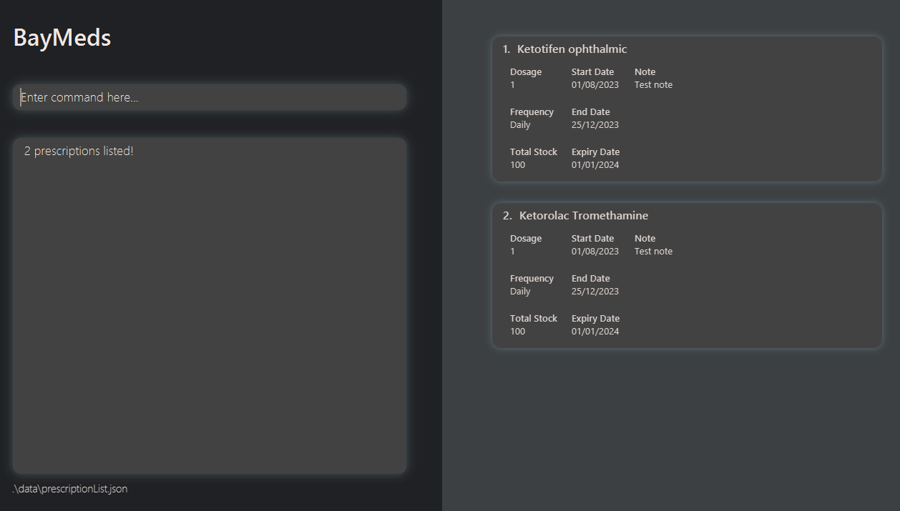

### Deleting a prescription : `delete`

You can delete a prescription from the list **permanently** by typing the following command.

Format:
```
delete INDEX
```

This deletes the prescription at the specified `INDEX`. The index refers to the index number shown according to [list](#listing-all-prescriptions--list).

<box type="info" header="Notes">

* `<index>` should be a positive integer.

</box>

<box type="definition" header="#### Example">

```
delete 3
```

Typing this command deletes the 3rd prescription from the list.

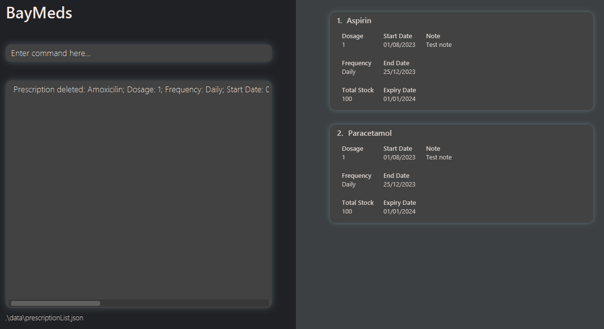

</box>

### How to take a medication : `take`

You can tell BayMeds that you have taken a medication.

To take a medication, type the following command.

Format:
```
take
  INDEX
  [d/<dosage>]
```

This tells BayMeds that you have taken the prescription at the specified `INDEX`. The index refers to the index number shown according to [list](#listing-all-prescriptions--list).

<box type="info" header="Notes">

* `<dosage>` refers to the number of pills to be taken. It only accepts a numeric value. For 1 pill, type 1.
* Since `<dosage>` is an optional input, if there is none given, the default dosage to take will be set as 1.
* Existing consumption count will be increased by the input value.
* Existing stock will be decreased by the input value.

If you would like to see the updated consumption count and stock, use [listToday](#how-to-list-todays-medications--listtoday).
</box>

<box type="definition" header="#### Example 1">

```
take 1
```
Typing this command will take 1 dose from the 1st prescription.

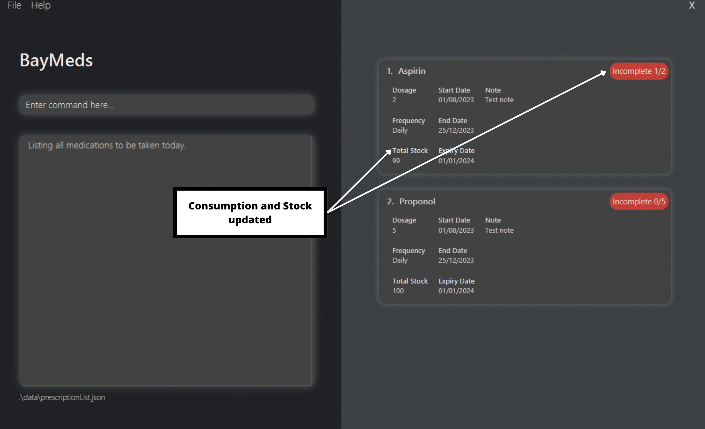

As shown in this example, the dosage taken is set as 1 if not dosage is specified.
</box>

<box type="definition" header="#### Example 2">

```
take 2 d/2
```
Typing this command will take 2 doses from the 2nd prescription.

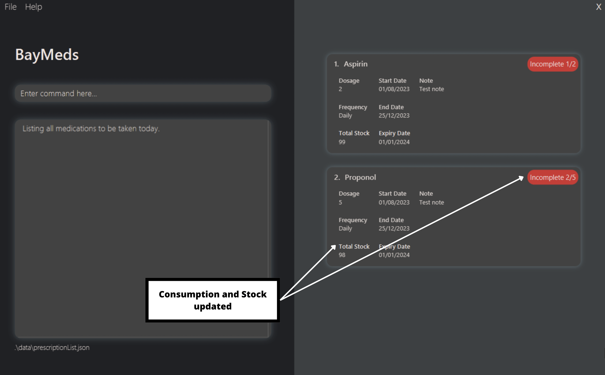

</box>

### How to untake a medication : `untake`

If you have accidentally indicated that you have taken a medication, Baymeds can also help you untake the medication.

This command is similar to the take command.

To untake a medication, type the following command.

Format:
```
untake
  INDEX
  [d/<dosage>]
```

This tells BayMeds that you have untaken the prescription at the specified `INDEX`. The index refers to the index number shown according to [list](#listing-all-prescriptions--list).

<box type="info" header="Notes">

* `<dosage>` refers to the number of pills to be untaken. It only accepts a numeric value. For 1 pill, type 1.
* Since `<dosage>` is an optional input, if there is none given, the default dosage to untake will be set as 1.
* Existing consumption count will be decreased by the input value.
* Existing stock will be increased by the input value.

If you would like to see the updated consumption count and stock, use [listToday](#how-to-list-todays-medications--listtoday).
</box>

<box type="definition" header="#### Example 1">

```
untake 1
```
Typing this command will untake 1 dose from the 1st prescription.

Using the same prescription list as shown in [take](#how-to-take-a-medication--take), you will get the following result:


As shown in this example, the dosage to untake is set as 1 if not dosage is specified.
</box>

<box type="definition" header="#### Example 2">

```
untake 2 d/2
```
Typing this command will untake 2 doses from the 2nd prescription.

Using the same prescription list as shown in [take](#how-to-take-a-medication--take), you will get the following result:

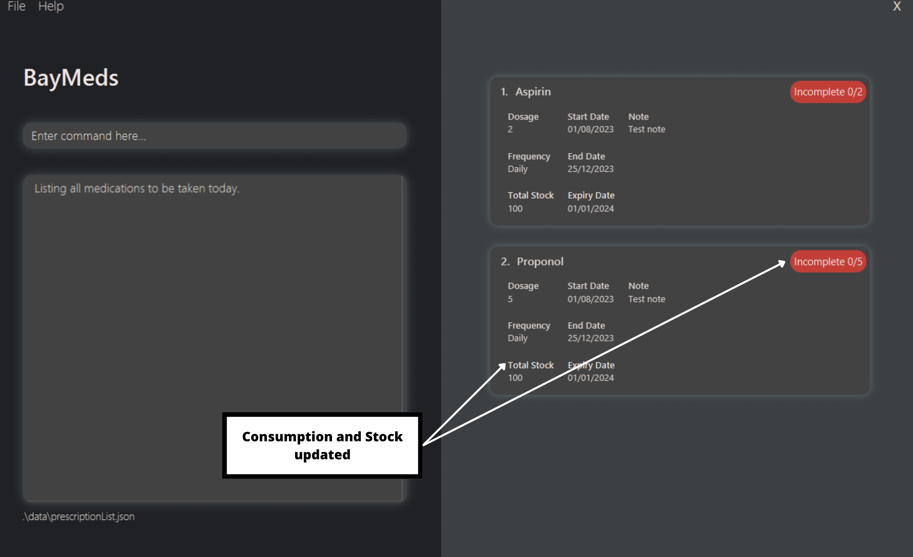

</box>

### Listing medications that are about to expire or are low in stock : `reminder`

If you need to know which medications are near expiry or are low in stock, type the following command.

Format:
```
reminder
```

You will then be able to see medications that are near expiry or low in stock on the right side.

<box type="info" header="Notes">

*  Medications that are about to expire are defined as medications that are expiring within the next 7 days.
*  Medications that are low in stock are defined as medications that either have less than 10 tabs left or have 7 dosages worth left.

</box>

<box type="definition" header="#### Example">

If you have prescriptions near expiry or low in stock, you will see something similar to this.

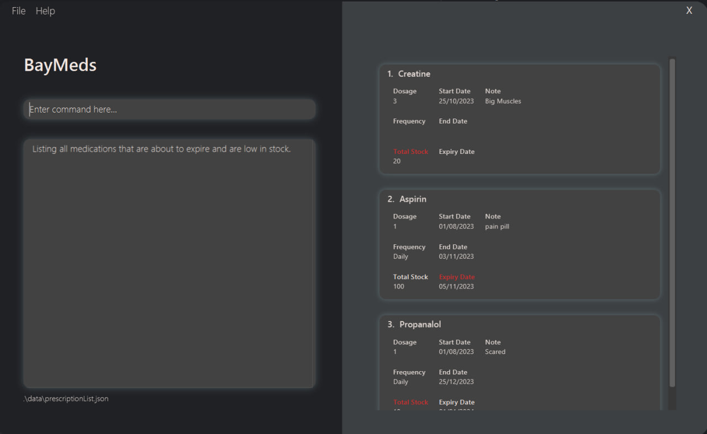

</box>

### Listing a prescription's conflicting drugs : `listConflicts`

If you want to view the list of drugs that conflict with a prescription at a particular index, type the following command.

Format:
```
listConflicts INDEX
```

You will then be able to see the conflicting drugs on the left side.

<box type="info" header="Notes">

* `<index>` should be a positive integer.

</box>

<box type="definition" header="#### Example">

```
listConflicts 2
```

If you have conflicting drugs for the prescription at the index, you will see something similar to this.

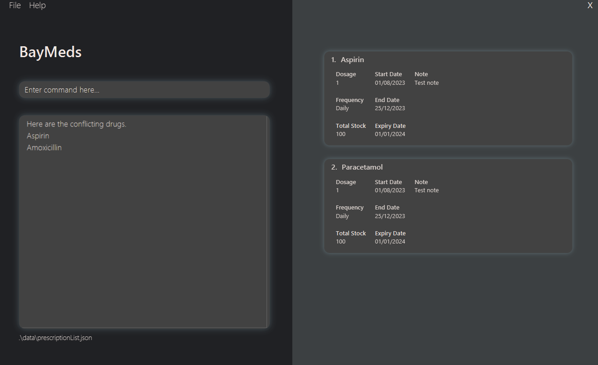

</box>

### Listing all conflicting drugs : `listAllConflicts`

If you need to view all drugs that conflict with your current prescriptions, type the following command.

Format:
```
listAllConflicts
```

You will then be able to see all conflicting drugs on the left side.

<box type="definition" header="#### Example">

```
listAllConflicts
```

If you have conflicting drugs for the current prescriptions, you will see something similar to this.

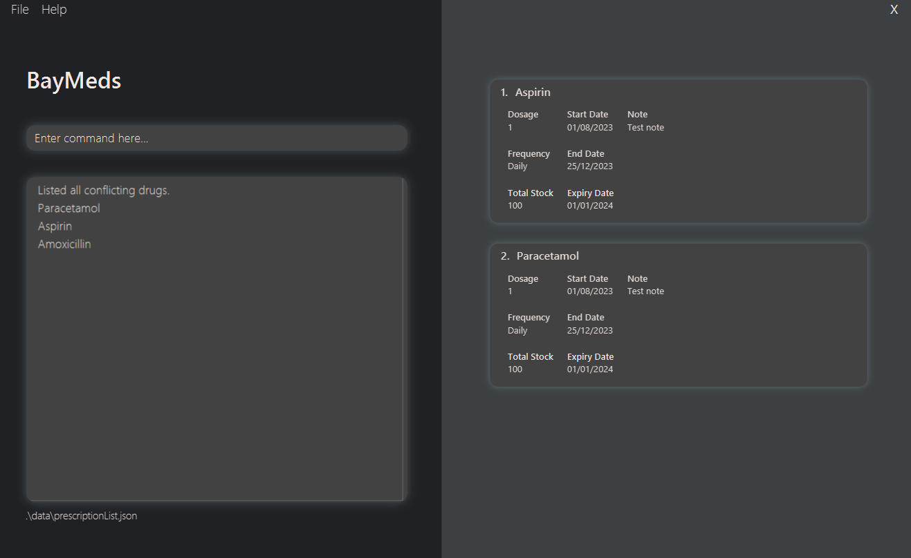

</box>

### Viewing help : `help`

Opens a help window. Embedded in the help window is a link to the official BayMeds user guide.

Format:
```
help
```

### Exiting BayMeds : `exit`

Exits the application.

Format:
```
exit
```

### Saving the data

BayMeds data are saved in the hard disk automatically after any command that changes the data. There is no need to save manually.

### Editing the data file

BayMeds data are saved automatically as a JSON file `[JAR file location]/data/prescriptionList.json and completedPrescriptionList.json`. Advanced users are welcome to update data directly by editing that data file.

<box type="warning" seamless>

**Caution:**
If your changes to the data file makes its format invalid, BayMeds will discard all data and start with an empty data file at the next run.  Hence, it is recommended to take a backup of the file before editing it.
</box>

### Archiving data files `[coming in v2.0]`

_Details coming soon ..._

--------------------------------------------------------------------------------------------------------------------

## FAQ

**Q**: How do I store the size and colour of the pill?<br>
**A**: Add it as a note when adding the prescription.<br>

**Q**: How do I know if I have taken the medication for the day?<br>
**A**: Use `listToday` command to list out all medications to be taken for the day.
Medication with a green label have been taken while those with a red label have yet to be taken.<br>

**Q**: Is my data shared with other software or organisations?<br>
**A**: Data is stored locally in the computer and is not stored in any external database nor shared with other third parties.
We recommend locking your device before leaving it unattended to prevent others from accessing your prescription records and consumption history.<br>

**Q**: How do I transfer my data to another Computer?<br>
**A**: Install the app in the other computer and overwrite the empty data file it creates with the file that contains the data of your previous BayMeds home folder.<br>

--------------------------------------------------------------------------------------------------------------------

## Known issues

1. **When using multiple screens**, if you move the application to a secondary screen, and later switch to using only the primary screen, the GUI will open off-screen. The remedy is to delete the `preferences.json` file created by the application before running the application again.

--------------------------------------------------------------------------------------------------------------------

## Command summary

| Action                   | Format, Example                                                                                                                                                                                                                                                 |
|--------------------------|-----------------------------------------------------------------------------------------------------------------------------------------------------------------------------------------------------------------------------------------------------------------|
| **Add**                  | `add mn/<medication_name> [d/<dosage>] [f/<frequency>]  [sd/<start_date>] [ed/<end_date>] [exd/<expiry_date>] [ts/<total_stock>] [n/<note>]`, <br> e.g. `add mn/Aspirin d/1 f/Daily sd/20/09/2023 ed/03/10/2024 exp/04/10/2024 ts/100 n/Take during meals`      |
| **Delete**               | `delete <index>`, <br> e.g. `delete 2`                                                                                                                                                                                                                          |
| **Mark**                 | `take <index> [d/<dosage_taken>]`, <br> e.g. `take 1 d/1`                                                                                                                                                                                                       |
| **List**                 | `list`                                                                                                                                                                                                                                                          |
| **List today**           | `listToday`                                                                                                                                                                                                                                                     |
| **List completed**       | `listCompleted`                                                                                                                                                                                                                                                 |
| **Find**                 | `find <keyword>`, <br> e.g. `find Aspirin`                                                                                                                                                                                                                      |
| **Reminder**             | `reminder`                                                                                                                                                                                                                                                      |
| **List conflicts**       | `listConflicts`                                                                                                                                                                                                                                                 |
| **List all conflicts**   | `listAllConflicts`                                                                                                                                                                                                                                              |
| **Help**                 | `help`                                                                                                                                                                                                                                                          |
| **Exit**                 | `exit`                                                                                                                                                                                                                                                          |
