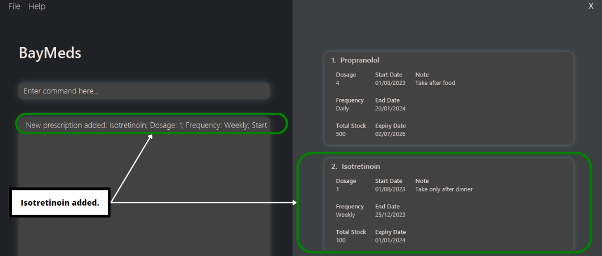

# BayMeds v.2103 User Guide

BayMeds v.2103, (a.k.a BayMeds), is a **desktop application for managing your medications**. While it has a GUI (Graphical User Interface), most of the user interactions happen using a CLI (Command Line Interface). If you like to type fast, BayMeds can get your medication management tasks done faster than traditional GUI apps.

<!-- * Table of Contents -->
<page-nav-print />

--------------------------------------------------------------------------------------------------------------------

## Quick start

1. Ensure you have Java `11` or above installed in your Computer.

1. Download the latest `BayMeds.jar` from [here](https://github.com/se-edu/addressbook-level3/releases). [coming soon]

1. Copy the file to the folder you want to use as the _home folder_ for BayMeds.

1. Open a command terminal, `cd` into the folder you put the jar file in, and use the `java -jar BayMeds.jar` command to run the application.<br>
   A GUI similar to the one below should appear in a few seconds. Note how the app contains some sample data.<br>
   

1. Type commands in the command box and press Enter to execute it. <br> e.g. typing the command **`help`** and pressing Enter will open the help window.<br>

   Some example commands you can try:

   * `list` : Lists all prescriptions.

   * `add --medication "Doxazosin" --frequency "daily"` : Adds a prescription `Aspirin` to the list of medications.

   * `delete "Aspirin"` : Deletes the `Aspirin` prescription from the current list of medications.

1. Refer to the [Features](#features) below for details of each command.

--------------------------------------------------------------------------------------------------------------------

## Features

<box type="info" seamless>

**Notes about the command format:**<br>

* Words in `<>` are the parameters to be supplied by the user, and should begin and end with double quotation marks " ".<br>
  e.g. in `add --medication <medication_name>`, `<medication_name>` is a parameter which can be used as `add --medication "Aspirin"`.

* Items in square brackets are optional.<br>
  e.g. `--frequency <frequency> [--start <start_date>]` can be used as `--frequency "daily" --start "20-9-2023"` or as `--frequency "daily"`.

* Parameters can be in any order.<br>
  e.g. if the command specifies `--medication <medication_name> --frequency <frequency>`, `--frequency <frequency> --medication <medication_name>` is also acceptable.

* Extraneous parameters for commands that do not take in parameters (such as `help`, `list`) will be ignored.<br>
  e.g. if the command specifies `help 123`, it will be interpreted as `help`.

* If you are using a PDF version of this document, be careful when copying and pasting commands that span multiple lines as space characters surrounding line-breaks may be omitted when copied over to the application.
</box>

### Viewing help : `help` [coming soon]


### Adding a prescription : `add`

Adds a prescription to the list of medications.

Format: 
```
add 
  --medication <medication_name>
  --frequency <frequency> 
  [--start <start_date>]
  [--end <end_date>]
  [--remarks <remarks>] 
```

* `<frequency>` should follow this format `<repetition dosage>`
  * e.g. `--frequency "daily 2"`.
    * This means take 2 tabs everyday.
  * e.g. `--frequency "daily 4"`.
    * This means take 4 tabs everyday.
  * e.g. `--frequency "weekly 2"`. 
    * This means take 2 tabs on a particular day every week. The day is determined by the `<start_date>` input. If `<start_date>` is a Wednesday, this means take 2 tabs every Wednesday.
* If your prescriptions are to be taken every Wednesday and Sunday, add 2 separate entries into the list of medications
  * `Add --medication "Accutane 1" --frequency "weekly 1" --start "27-09-2023"`
  * `Add --medication "Accutane 2" --frequency "weekly 1" --start "01-10-2023"`
* `<start_date>` and `<end_date>` should be in dd-mm-yyyy format.   
  * e.g. "20-09-2023"
* Since `--start <start_date>` is an optional input, if there is none given, the input date of the entry will be used as the default start date.
* Remarks can consist of any text.
  * e.g. "To be taken after meals"
  * e.g. "Take after food"

Examples:
* `add --medication "Aspirin" --frequency "daily" --start "20-09-2023" --end "03-10-2024" --remarks "Take during meals"`
* `add --medication "Amoxicillin" --frequency "twice daily" --start "20-09-2023" --end "03-10-2024"`
* `add --medication "Doxazosin" --frequency "daily"`

Example usage of add command in BayMeds:



### Listing all persons : `list`

Shows a list of all persons in the address book.

Format: `list`

### Editing a person : `edit`

Edits an existing person in the address book.

Format: `edit INDEX [n/NAME] [p/PHONE] [e/EMAIL] [a/ADDRESS] [t/TAG]…​`

* Edits the person at the specified `INDEX`. The index refers to the index number shown in the displayed person list. The index **must be a positive integer** 1, 2, 3, …​
* At least one of the optional fields must be provided.
* Existing values will be updated to the input values.
* When editing tags, the existing tags of the person will be removed i.e adding of tags is not cumulative.
* You can remove all the person’s tags by typing `t/` without
    specifying any tags after it.

Examples:
*  `edit 1 p/91234567 e/johndoe@example.com` Edits the phone number and email address of the 1st person to be `91234567` and `johndoe@example.com` respectively.
*  `edit 2 n/Betsy Crower t/` Edits the name of the 2nd person to be `Betsy Crower` and clears all existing tags.

### Locating persons by name : `find`

Finds persons whose names contain any of the given keywords.

Format: `find KEYWORD [MORE_KEYWORDS]`

* The search is case-insensitive. e.g `hans` will match `Hans`
* The order of the keywords does not matter. e.g. `Hans Bo` will match `Bo Hans`
* Only the name is searched.
* Only full words will be matched e.g. `Han` will not match `Hans`
* Persons matching at least one keyword will be returned (i.e. `OR` search).
  e.g. `Hans Bo` will return `Hans Gruber`, `Bo Yang`

Examples:
* `find John` returns `john` and `John Doe`
* `find alex david` returns `Alex Yeoh`, `David Li`<br>
  

### Deleting a person : `delete`

Deletes the specified prescription from the list of medications.

Format:
```
delete
  --medication <medication_name>
```

* Deletes the person at the specified `INDEX`.
* The index refers to the index number shown in the displayed person list.
* The index **must be a positive integer** 1, 2, 3, …​

Examples:
* `list` followed by `delete 2` deletes the 2nd person in the address book.
* `find Betsy` followed by `delete 1` deletes the 1st person in the results of the `find` command.

### Clearing all entries : `clear`

Clears all entries from the address book.

Format: `clear`

### Exiting the program : `exit`

Exits the program.

Format: `exit`

### Saving the data

AddressBook data are saved in the hard disk automatically after any command that changes the data. There is no need to save manually.

### Editing the data file

AddressBook data are saved automatically as a JSON file `[JAR file location]/data/addressbook.json`. Advanced users are welcome to update data directly by editing that data file.

<box type="warning" seamless>

**Caution:**
If your changes to the data file makes its format invalid, AddressBook will discard all data and start with an empty data file at the next run.  Hence, it is recommended to take a backup of the file before editing it.
</box>

### Archiving data files `[coming in v2.0]`

_Details coming soon ..._

--------------------------------------------------------------------------------------------------------------------

## FAQ

**Q**: How do I transfer my data to another Computer?<br>
**A**: Install the app in the other computer and overwrite the empty data file it creates with the file that contains the data of your previous AddressBook home folder.

--------------------------------------------------------------------------------------------------------------------

## Known issues

1. **When using multiple screens**, if you move the application to a secondary screen, and later switch to using only the primary screen, the GUI will open off-screen. The remedy is to delete the `preferences.json` file created by the application before running the application again.

--------------------------------------------------------------------------------------------------------------------

## Command summary

Action     | Format, Examples
-----------|----------------------------------------------------------------------------------------------------------------------------------------------------------------------
**Add**    | `add n/NAME p/PHONE_NUMBER e/EMAIL a/ADDRESS [t/TAG]…​` <br> e.g., `add n/James Ho p/22224444 e/jamesho@example.com a/123, Clementi Rd, 1234665 t/friend t/colleague`
**Clear**  | `clear`
**Delete** | `delete INDEX`<br> e.g., `delete 3`
**Edit**   | `edit INDEX [n/NAME] [p/PHONE_NUMBER] [e/EMAIL] [a/ADDRESS] [t/TAG]…​`<br> e.g.,`edit 2 n/James Lee e/jameslee@example.com`
**Find**   | `find KEYWORD [MORE_KEYWORDS]`<br> e.g., `find James Jake`
**List**   | `list`
**Help**   | `help`
