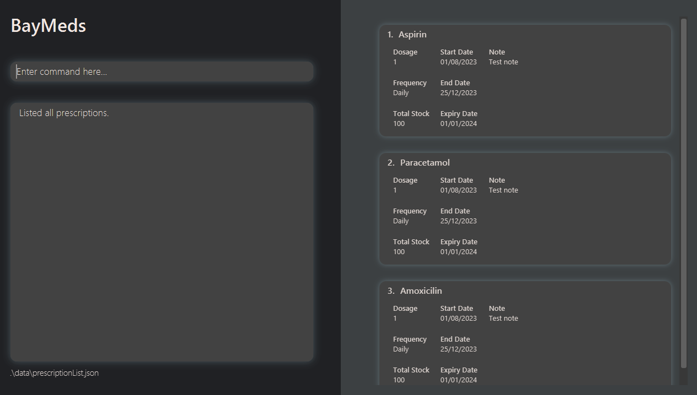

# BayMeds v.2103 User Guide

### What is BayMeds?

BayMeds v.2103 (a.k.a BayMeds) is your go-to prescription management solution, catering to anyone seeking a streamlined and effective way to track prescriptions. Ideal for those with busy lives and complex medication regimens, BayMeds offer reminders for staying on top of prescription schedules and provides a platform to track prescription consumptions. With a focus on user-friendliness, BayMeds aims to promote medication adherence and reduce misusage.

### What can I do with BayMeds?

#### Track consumption of existing prescriptions

BayMeds filters and shows you your prescriptions to be consumed each day. By marking prescriptions you have consumed, BayMeds will differentiate and show you the prescriptions that are completed and those that have yet to be completed for the day.

#### Store important details of existing prescriptions

BayMeds allows you to store details crucial to the consumption of the prescription, such as the end and expiry date of the prescription, as well as the current stock of pills available. You may also store specific requirements that a prescription may have, such as restricted consumption to only after heavy meals.

#### Get reminders on prescriptions to be consumed

BayMeds reminds you to consume your prescriptions for the day on a regular interval, to promote medication adherence.

#### Track past prescriptions

BayMeds enables storage of past prescriptions, i.e. prescriptions that you have completed in the past. This provides ease of access to such information when required, such as during a Doctor's visit, or when checking how many pills of a particular prescription I took in the past I have left.

<!-- * Table of Contents -->
<page-nav-print />

--------------------------------------------------------------------------------------------------------------------

## Quick start

1. Ensure you have Java `11` or above installed in your Computer.

1. Download the latest `BayMeds.jar` from [here](https://github.com/AY2324S1-CS2103T-T15-2/tp/releases/tag/v1.3.trial).

1. Copy the file to the folder you want to use as the _home folder_ for BayMeds.

1. Open a command terminal, `cd` into the folder you put the jar file in, and use the `java -jar BayMeds.jar` command to run the application.<br>
   A GUI similar to the one below should appear in a few seconds. Note how the app contains some sample data.<br>
   

1. Type commands in the command box and press Enter to execute it. <br> e.g. typing the command **`help`** and pressing Enter will open the help window.<br>

   Some example commands you can try:

   * `list` : Lists all prescriptions.

   * `add mn/Doxazosin f/Daily` : Adds a prescription `Doxazosin` to the list of prescriptions.

   * `delete 2` : Deletes the second prescription from the current list of prescriptions.


1. Refer to the [Features](#features) below for details of each command.

--------------------------------------------------------------------------------------------------------------------

## Features

<box type="info" seamless>

**Notes about the command format:**<br>

* Words in `<>` are the parameters to be supplied by the user.<br>
  e.g. in `add mn/<medication_name>`, `<medication_name>` is a parameter which can be used as `add mn/Aspirin`.

* Items in square brackets are optional.<br>
  e.g. `mn/<medication_name> [sd/<start_date>]` can be used as `mn/Aspirin sd/25/10/2023` or as `mn/Aspirin`.

* Parameters can be in any order.<br>
  e.g. if the command specifies `mn/<medication_name> f/<frequency>`, `f/<frequency> mn/<medication_name>` is also acceptable.


* If you are using a PDF version of this document, be careful when copying and pasting commands that span multiple lines as space characters surrounding line-breaks may be omitted when copied over to the application.
</box>


### Adding a prescription : `add`

Adds a prescription to the list of prescriptions.

Format:
```
add
  mn/<medication_name>
  [d/<dosage>]
  [f/<frequency>]
  [sd/<start_date>]
  [ed/<end_date>]
  [exp/<expiry_date>]
  [ts/<total_stock>]
  [n/<note>]
```

* If your prescriptions are to be taken on uneven intervals, or falls outside of the Daily/Weekly/Monthly categories, add 2 separate entries into the list of prescriptions.
<br> For instance, if your prescriptions are to be taken every Wednesdays and Sundays, add a weekly entry for Wednesdays and another weekly entry for Sundays. BayMeds will track both entries separately and remind you both on Wednesdays and Sundays to consume your prescriptions.
  * `add mn/Accutane sd/27/09/2023 f/Weekly`.
  * `add mn/Accutane sd/01/10/2023 f/Weekly`.

* `<start_date>` and `<end_date>` should be in dd/mm/yyyy format.
  * e.g. "20/09/2023".
* Since `--start <start_date>` is an optional input, if there is none given, the input date of the entry will be used as the default start date.
* Note can consist of any text.
  * e.g. "To be taken after meals".
  * e.g. "Take after food".

Examples:
* `add mn/Aspirin d/1 f/Daily sd/20/09/2023 ed/03/10/2024 exd/04/10/2024 ts/100 n/Take during meals`.
* `add mn/Amoxicillin f/Weekly sd/20/09/2023 ed/03/10/2024`.
* `add mn/Doxazosin`.

Example output of add command in BayMeds:


### Listing all prescriptions : `list`

Shows a list of all prescriptions.

Format:
```
list
```

Example output of list command in BayMeds:


### Listing today's medications : `listToday`

Lists all medications to be taken for the day.

Format:
```
listToday
```

Example output of list today command in BayMeds:


### Listing completed prescriptions : `listCompleted`

Lists all completed prescriptions.

Format:
```
listCompleted
```

Example output of list completed command in BayMeds:


### Editing a prescription : `edit`

Edits an existing prescription in the prescription list.

Format:
```
edit
  INDEX
  [mn/NAME]
  [d/DOSAGE]
  [f/FREQUENCY]
  [sd/START DATE]
  [ed/END DATE]
  [exd/EXPIRY DATE]
  [ts/TOTAL STOCK]
  [n/NOTE]
```

* Edits the prescription at the specified `INDEX`. The index refers to the index number shown in the displayed prescription list. The index **must be a positive integer** 1, 2, 3, …​
* At least one of the optional fields must be provided.
* Existing values will be updated to the input values.
* Input values cannot be empty.

Examples:
*  `edit 1 d/2 f/Daily` Edits the dosage and frequency of the 1st prescription to be `2` and `Daily` respectively.
*  `edit 2 mn/Creatine n/Red Pill` Edits the name of the 2nd prescription to be `Creatine` and note to be `Red Pill`.

Example output of edit command in BayMeds:


### Locating prescriptions by name : `find`

Finds prescriptions which names contain any of the given keywords.

Format: `find KEYWORD [MORE_KEYWORDS]`

* The search is case-insensitive. e.g `paracetamol` will match `Paracetamol`
* The order of the keywords does not matter. e.g. `Ketoconazole Shampoo` will match `Shampoo Ketoconazole`
* Only the name is searched.
* Only full words will be matched e.g. `Para` will not match `Paracetamol`
* Prescriptions matching at least one keyword will be returned (i.e. `OR` search).
  e.g. `Ketorolac ophthalmic` will return `Ketotifen ophthalmic`, `Ketorolac Tromethamine`

Examples:
* `find Ketoconazole` returns `Ketoconazole` and `Ketoconazole Shampoo`
* `find Ketorolac ophthalmic` returns `Ketotifen ophthalmic`, `Ketorolac Tromethamine`<br>
  

### Deleting a prescription : `delete`

Deletes the specified prescription from the list of prescriptions.

Format:
```
delete <index>
```

* `<index>` should be a positive integer.

Examples:
* `delete 1`.
* `delete 3`.
* `delete 4`.

Example output of delete command in BayMeds:


### Marking a medication as taken : `take`

Takes a specified dose from a prescription in the list of prescriptions.

Format:
```
take
  INDEX
  [d/<dosage>]
```

* Takes a dose from the prescription at the specified `INDEX`. The index refers to the index number shown in the displayed prescription list. The index **must be a positive integer** 1, 2, 3, …​
* Existing consumption count will be increased by the input value.
* Existing stock will be decreased by the input value.
* Since `d/<dosage>` is an optional input, if there is none given, the default dosage to take will be set as 1.

Examples:
* `take 1 d/2`
* `take 2`

Example output of take command in BayMeds:


### Listing medications that are about to expire or are low in stock : `reminder`

Lists all medications that are about to expire or are low in stock.
Format:
```
reminder
```

*  Medications that are about to expire are defined as medications that are expiring within the next 7 days.
*  Medications that are low in stock are defined as medications that either have less than 10 tabs left or have 7 dosages worth left.

Example output of reminder command in BayMeds:


### Viewing help : `help`

Opens a help window. Embedded in the help window is a link to the official BayMeds user guide.

Format:
```
help
```

### Exiting BayMeds : `exit`

Exits the application.

Format:
```
exit
```

### Saving the data

BayMeds data are saved in the hard disk automatically after any command that changes the data. There is no need to save manually.

### Editing the data file

BayMeds data are saved automatically as a JSON file `[JAR file location]/data/prescriptionList.json and completedPrescriptionList.json`. Advanced users are welcome to update data directly by editing that data file.

<box type="warning" seamless>

**Caution:**
If your changes to the data file makes its format invalid, BayMeds will discard all data and start with an empty data file at the next run.  Hence, it is recommended to take a backup of the file before editing it.
</box>

### Archiving data files `[coming in v2.0]`

_Details coming soon ..._

--------------------------------------------------------------------------------------------------------------------

## FAQ

**Q**: How do I store the size and colour of the pill?<br>
**A**: Add it as a note when adding the prescription.<br>

**Q**: How do I know if I have taken the medication for the day?<br>
**A**: Use `listToday` command to list out all medications to be taken for the day.
Medication with a green label have been taken while those with a red label have yet to be taken.<br>

**Q**: Is my data shared with other software or organisations?<br>
**A**: Data is stored locally in the computer and is not stored in any external database nor shared with other third parties.
We recommend locking your device before leaving it unattended to prevent others from accessing your prescription records and consumption history.<br>

**Q**: How do I transfer my data to another Computer?<br>
**A**: Install the app in the other computer and overwrite the empty data file it creates with the file that contains the data of your previous BayMeds home folder.<br>

--------------------------------------------------------------------------------------------------------------------

## Known issues

1. **When using multiple screens**, if you move the application to a secondary screen, and later switch to using only the primary screen, the GUI will open off-screen. The remedy is to delete the `preferences.json` file created by the application before running the application again.

--------------------------------------------------------------------------------------------------------------------

## Command summary

| Action               | Format, Example                                                                                                                                                                                                                                                 |
|----------------------|-----------------------------------------------------------------------------------------------------------------------------------------------------------------------------------------------------------------------------------------------------------------|
| **Add**              | `add mn/<medication_name> [d/<dosage>] [f/<frequency>]  [sd/<start_date>] [ed/<end_date>] [exd/<expiry_date>] [ts/<total_stock>] [n/<note>]`, <br> e.g. `add mn/Aspirin d/1 f/Daily sd/20/09/2023 ed/03/10/2024 exp/04/10/2024 ts/100 n/Take during meals`      |
| **Delete**           | `delete <index>`, <br> e.g. `delete 2`                                                                                                                                                                                                                          |
| **Mark**             | `take <index> [d/<dosage_taken>]`, <br> e.g. `take 1 d/1`                                                                                                                                                                                                       |
| **List**             | `list`                                                                                                                                                                                                                                                          |
| **List today**       | `listToday`                                                                                                                                                                                                                                                     |
| **List completed**   | `listCompleted`                                                                                                                                                                                                                                                 |
| **Find**             | `find <keyword>`, <br> e.g. `find Aspirin`                                                                                                                                                                                                                      |
| **Reminder**         | `reminder`                                                                                                                                                                                                                                                      |
| **Help**             | `help`                                                                                                                                                                                                                                                          |
| **Exit**             | `exit`                                                                                                                                                                                                                                                          |
